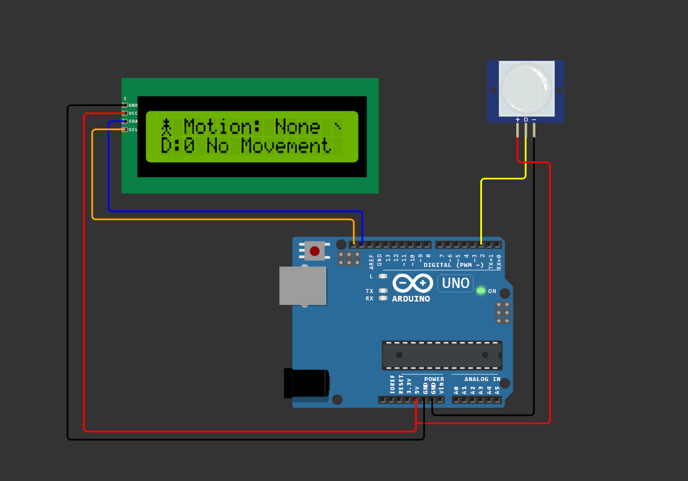

# 🕵️ PIR Motion Detection using I2C LCD

This Arduino project detects human motion using a **PIR (Passive Infrared) Sensor** and displays the real-time motion status on a **16x2 I2C LCD**.
Custom icons (person, alert, and sleep) make the LCD display visually informative and engaging.

---

## 🧠 Features

* 👁️ Real-time motion detection
* 💀 Alert symbol when movement is detected
* 😴 Idle/sleep icon when no motion is present
* 📟 Compact LCD display with I2C interface
* 🧾 Simple and low-power design

---

## 🧰 Components Required

| Component             | Quantity | Description                             |
| --------------------- | -------- | --------------------------------------- |
| Arduino Uno           | 1        | Microcontroller board                   |
| PIR Sensor (HC-SR501) | 1        | Detects motion using infrared radiation |
| 16x2 I2C LCD          | 1        | Displays motion status                  |
| Jumper Wires          | —        | For circuit connections                 |

---
## ⚙️ Circuit diagram


## ⚙️ Circuit Connections

| Module     | Pin | Arduino Pin |
| ---------- | --- | ----------- |
| PIR Sensor | VCC | 5V          |
| PIR Sensor | GND | GND         |
| PIR Sensor | OUT | D2          |
| I2C LCD    | SDA | SDA         |
| I2C LCD    | SCL | SCL         |

---

## 💻 Libraries Used

* `Wire.h` — For I2C communication
* `LiquidCrystal_I2C.h` — For I2C LCD control

Install via **Arduino IDE → Library Manager → Search "LiquidCrystal I2C"**

---

## 🔢 Code Overview

* Reads digital output from the PIR sensor
* Displays **“DETECTED”** when motion is sensed
* Shows **“None”** or **“No Movement”** when idle
* Uses custom icons for:

  * 👤 Person (active)
  * 💀 Alert (motion)
  * 😴 Sleep (idle)

---

## 📺 Sample LCD Output

```
👁️ Motion: DETECTED 💀
D:1 Movement 💀
```

or

```
👁️ Motion: None 😴
D:0 No Movement
```
